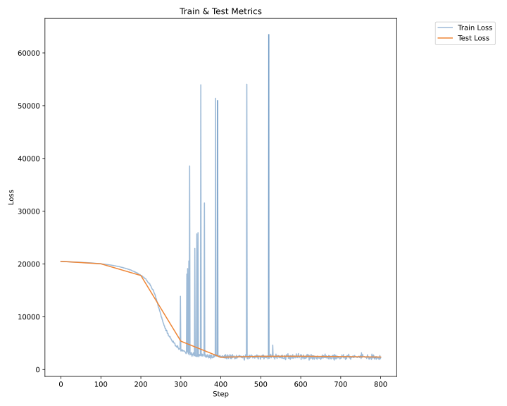
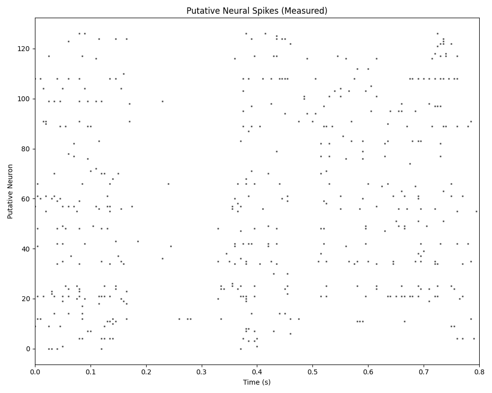
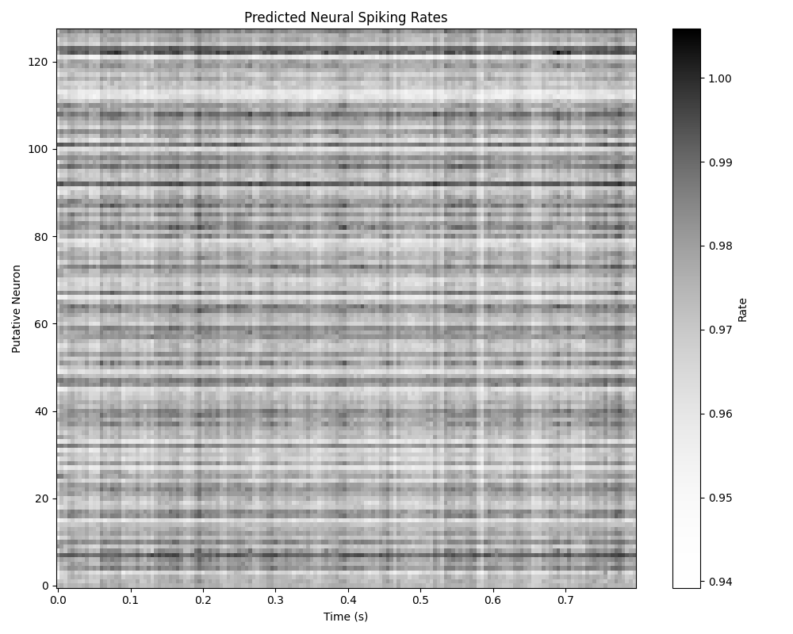
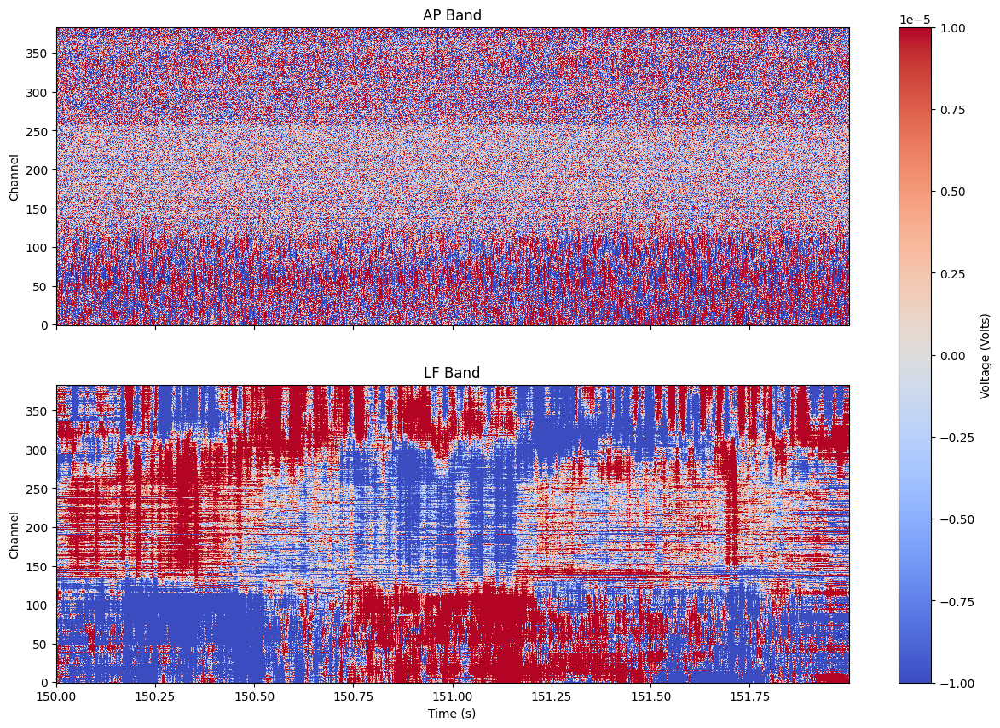
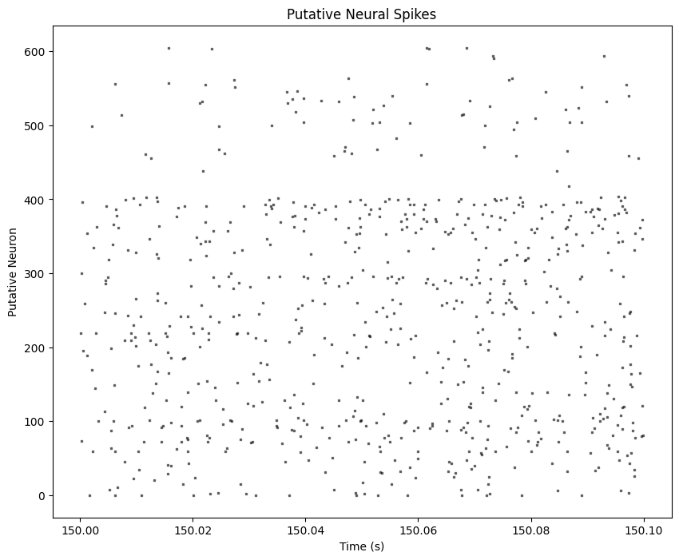

# python-lfads
PyTorch re-implementation of LFADS, intended to be minimal and educational as [minGPT](https://github.com/karpathy/minGPT) is to [GPT](https://github.com/openai/gpt-2).

## LFADS
Latent factor analysis via dynamical systems (LFADS) was introduced in 2018 as "a deep learning method to infer latent dynamics from single-trial neural spiking data" ([Pandarinath et al., 2018](https://doi.org/10.1038/s41592-018-0109-9)). Given a set of neural spike trains in the format of a binary matrix, it establishes latent states, factors, and reconstructed spiking rates. LFADS consists of a variational autoencoder (VAE) with recurrent neural networks (RNNs) for the encoder and decoder, constrained by a dynamical system to model unmeasured activity.

## Repository
Essential modules of this repository:
- `./src/prep_data.py` runs as a standalone script to prepare data from ONE (see below)
- `./src/main.py` is the entrypoint for a basic workflow training an LFADS model.
- `./src/trainer.py` contains the training loop.
- `./src/data.py` contains the dataloader.
- `./src/model.py` contains the LFADS model.
- `./src/utils.py` contains utility functions.

It may be helpful to note:
- `./eg_data` (tracked by git) contains example data that will be seeded into `./data` (not tracked by git) when the repository is set up with `./setup.sh`. This allows basic (though less useful) functionality of the primary workflow without requiring data prep with `./src/prep_data.py`.
- `./media/anatomy.csv` gives anatomy information for interfacing with ONE, as demonstrated in `./src/prep_data.py`.

## Usage
`./src/model.py` could be downloaded and installed for use in other applications. However, here I demonstrate the basic workflow for training the LFADS model.

1. Use GitHub to access the repository.
```sh
git clone https://github.com/jwborden/python-lfads.git
cd python-lfads
```
2. Set up accessory directories and seed data not tracked by git:
```sh
./setup.sh
```
3. Create a virtual environment and install dependencies
```sh
# for development mode:
python3.11 -m venv .venv
source ./.venv/bin/activate
pip install -e ".[dev]"

# for demo mode
python -m venv .venv
source ./.venv/bin/activate
pip install -e "."
```
4. Prepare the data. This takes a while, but can be optionally skipped for basic, less useful, functionality.
```sh
python -m src.prep_data
```
5. Run the training loop.
```sh
# to train on one insertion (one session, one probe)
python -m src.main --ins "f475ae14-9415-453e-b800-1480ea1c868d" # (or another pid)
# to train on all downloaded data
python -m src.main
```
As the training loop runs, it will periodically save the model's state dictionary, performance metrics, and example measured/inferred pairs in `./results`. Examples of these plots are shown below. The model could be reinstantiated later from the latest state dictionary for inference or fine-tuning.

### Example training curve
Spikes in training loss between steps 300-400 likely show movement of the parameters out of local minima associated with specific mini-batches during stochastic gradient descent.



### Example measured spikes


### Example predicted rates 100 steps into training


## Data
This project uses an open-source neuro-electrophysiology [dataset](https://figshare.com/articles/preprint/Data_release_-_Brainwide_map_-_Q4_2022/21400815) from The International Brain Laboratory ([IBL](https://www.internationalbrainlab.com/)), accessed via the [ONE API](https://int-brain-lab.github.io/ONE/). The API provides raw voltage recordings and spike trains established by [kilosort](https://papers.nips.cc/paper_files/paper/2016/file/1145a30ff80745b56fb0cecf65305017-Paper.pdf). A tutorial to the data is provided at `./data_demo.ipynb` and produces the figures below. In this project I collect and prepare data via ONE with `./src/prep_data.py`.

### Raw IBL data


### Spike-sorted IBL data

